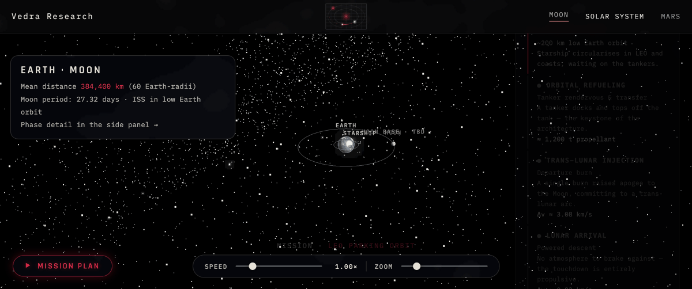
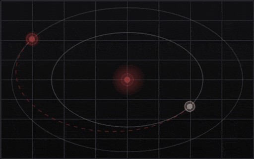

# Orbital Mechanics Engine



> Physics-based orbital mechanics engine — 8 planets, real mission planning, and a live 3D visualization driven by the same data.

<p align="center">
  <a href="https://github.com/Felixsavedra-1/orbital-mechanics-simulator/actions/workflows/ci.yml"></a>
  
  
  
</p>

A deterministic astrodynamics engine that computes orbital velocities, periods, transfer Δv, and real Earth→Mars launch windows from authoritative constants. The same JPL data drives an interactive Three.js dashboard, and a 139-test suite validates the physics against textbook worked examples and **live JPL Horizons** state vectors.

## Highlights

- **Validated against live JPL Horizons** — ephemeris accurate to ~1300 km (Earth); perturbed propagation to ~14 km/week.
- **Real launch-window analysis** — universal-variable Lambert solver + porkchop grid search yield actual Earth→Mars departure dates, plus an impulsive injection/capture Δv budget.
- **High-fidelity propagation** — adaptive DOP853 integrator with zonal gravity (J2–J6), a banded exponential atmosphere, solar radiation pressure, and third-body perturbations.
- **Clean layered architecture** — a zero-dependency stdlib core with numpy/scipy imported lazily only for the high-fidelity layer.
- **139 tests across 9 modules** — physics, schema contracts, Kepler round-trips, and conservation diagnostics, plus an interactive 3D Three.js dashboard.

**Tech stack:** Python 3.12 · numpy · scipy · Three.js · unittest

## Quickstart

```bash
git clone git@github.com:Felixsavedra-1/orbital-mechanics-simulator.git
python3 main.py            # report engine — pure stdlib, no install
open solar_system.html     # interactive 3D dashboard
```

The report engine is pure Python 3 standard library. The `astrodynamics/` high-fidelity layer adds numpy + scipy (`pip install -r requirements.txt`); it's imported lazily, so the default report needs no install.

---

<details>
<summary><b>What It Computes</b></summary>

<br>

**Report engine (stdlib):**
- **Orbital velocity & period** — all 8 planets (JPL J2000.0 semi-major axes)
- **Earth systems** — ISS and Moon velocity, period, and escape velocity
- **Hohmann transfer Δv** — LEO→Moon and Earth→Mars maneuvers
- **Vis-viva velocity** — elliptical orbit speed at any point
- **Tsiolkovsky mass ratio** — propellant fraction from Δv and Isp
- **RK4 two-body propagator** — numerical trajectory integration (`propagator.py`)

**High-fidelity astrodynamics layer (`astrodynamics/`, numpy/scipy):**
- **Full 6-element orbital state** — classical elements ↔ Cartesian, robust Kepler solver
- **Lambert transfer design** — universal-variable two-point boundary-value solver
- **Porkchop launch windows** — real departure dates from approximate JPL ephemerides, with an impulsive injection + capture Δv budget
- **Perturbed propagation** — zonal gravity (J2–J6), banded exponential atmosphere, solar radiation pressure, and third-body on an adaptive DOP853 integrator
- **Validated against JPL Horizons** — ephemeris to ~1300 km (Earth), propagation to ~14 km/week

</details>

<details>
<summary><b>Fidelity &amp; Limitations</b></summary>

<br>

This is an **engineering-fidelity** astrodynamics engine, validated against textbook worked examples and live JPL Horizons vectors. It is deliberately **not** operational flight software — that bar is one of process and certification (DO-178C, NASA NPR 7150.2, independent V&V, real tracking-data pipelines), not code quality.

**What is modeled:** two-body and perturbed dynamics with zonal gravity to degree 6 (J2–J6), a banded exponential atmosphere (Vallado Table 8-4), cannonball solar radiation pressure with a cylindrical shadow, third-body gravity, universal-variable Lambert targeting, porkchop launch-window search, and an impulsive injection/capture Δv budget. The mission Δv is **impulsive** — it excludes finite-burn and gravity losses, launch ascent, and entry/descent/landing.

**Where higher fidelity would go next** (deliberately out of scope to keep the engine lightweight and dependency-light):

- **Ephemerides** — JPL DE440 SPICE kernels for meter-level planetary positions (vs. the current Standish approximate model, ~sub-arcmin for the inner planets, 1800–2050).
- **Gravity field** — full tesseral spherical-harmonic models (e.g. EGM2008 to 70×70+) beyond the zonal-only field here.
- **Atmosphere** — NRLMSISE-00 / drag-temperature models driven by solar and geomagnetic indices.
- **Navigation** — orbit determination (batch least-squares / Kalman filtering) over real tracking data.

Each of these is data- or infrastructure-bound rather than a missing equation; they are the natural next tier for anyone extending the engine.

</details>

<details>
<summary><b>3D Visualization</b></summary>

<br>

```bash
open solar_system.html        # macOS
xdg-open solar_system.html   # Linux
```

Or double-click `solar_system.html` in Finder. Requires internet (Three.js via CDN).

The animation uses the same JPL semi-major axes and Kepler velocities as the report engine — no separate dataset.

### Three tabbed views

One renderer, three views — each runs a live mission narrative driven by the speed slider:

- **Moon** `1` — the Earth–Moon system with the ISS in low Earth orbit and a flagged Moon-base site. A four-phase **Starship lunar mission** loops continuously: LEO parking orbit → orbital refueling (a tanker docks via a glowing fuel link) → trans-lunar injection (Δv 3.08 km/s) → lunar arrival (Δv 0.83 km/s).
- **Solar System** `2` — all 8 planets on their J2000.0 orbits. Click any planet — or use the body picker, top-right — to ease the camera in and dock a data sheet of its physical stats and a one-line blurb.
- **Mars** `3` — a heliocentric Earth → Mars **Starship Hohmann transfer**. The craft rides the minimum-energy ellipse past the TMI / Cruise / MOI waypoints, while the side panel steps through each phase: Trans-Mars Injection (Δv ~2.95 km/s) → ~259-day coast → Mars Orbit Insertion (Δv ~2.65 km/s; total ~5.59 km/s).

A live caption (bottom) names the current phase, in sync with the stepped side panel (right).

| Control | Action |
|---|---|
| Tabs | Switch view — click, keys `1`/`2`/`3`, or `←`/`→` |
| Drag | Orbit camera |
| Scroll | Zoom |
| Right-drag | Pan |
| Speed slider | 0× pause → 6× fast-forward |

</details>

<details>
<summary><b>Report Engine (CLI)</b></summary>

<br>

```bash
python3 main.py                                          # full report, text
python3 main.py --section planets                        # one section
python3 main.py --format json --output report.json       # machine-readable
python3 main.py --format csv  --output report.csv
```

| Flag | Options |
|---|---|
| `--section` | `all` · `planets` · `earth` · `concepts` · `mars-base` · `transfers` · `mission` |
| `--format` | `text` · `json` · `csv` |
| `--output` | file path — omit to print to stdout |

> `mission` runs a live Lambert/porkchop search (needs `numpy`/`scipy`); it is excluded from `all` so the default report stays stdlib-only.

</details>

<details>
<summary><b>Architecture</b></summary>

<br>

```
Report engine (pure stdlib)
  calculations.py   orbital velocity, period, escape velocity, vis-viva, Hohmann, Tsiolkovsky
  constants.py      G, AU, masses, MU_* parameters, J2, atmosphere model
  data.py           planet and orbit datasets (JPL J2000.0)
  propagator.py     RK4 two-body numerical integrator
  report.py         record builder + text / JSON / CSV renderers
  main.py           CLI entrypoint

astrodynamics/ (high-fidelity layer, numpy/scipy)
  state.py          orbital elements ↔ Cartesian state, Kepler solver
  ephemeris.py      approximate JPL planetary positions + Julian-date utilities
  lambert.py        universal-variable Lambert solver
  porkchop.py       launch-window / Δv grid search
  forces.py         J2, drag, third-body perturbations
  integrators.py    scipy DOP853 adaptive propagation + conservation diagnostics

solar_system.html   3D animation (Three.js, CDN)
tests/              139 tests across 9 modules
```

**Data flow:** `main.py` → `render_report()` → renderer → `collect_records()` → section builders → `calculations.py` (or, for the `mission` section, the `astrodynamics/` layer)

</details>

<details>
<summary><b>Physics Reference</b></summary>

<br>

| Quantity | Formula | Unit |
|---|---|---|
| Orbital velocity | `v = √(GM / r)` | km/s |
| Orbital period | `T = 2π √(r³ / GM)` | hours |
| Escape velocity | `v_esc = √(2GM / r)` | km/s |
| Vis-viva | `v = √(GM (2/r − 1/a))` | km/s |
| Hohmann Δv | departure + arrival burns on transfer ellipse | km/s |
| Tsiolkovsky | `m₀/m_f = exp(Δv / (I_sp · g₀))` | — |

*G* = 6.67430 × 10⁻¹¹ m³ kg⁻¹ s⁻² (CODATA 2018) · *g₀* = 9.80665 m/s² (exact, BIPM)

</details>

<details>
<summary><b>Data Sources</b></summary>

<br>

| Quantity | Source |
|---|---|
| Gravitational constant *G* | CODATA 2018 |
| Astronomical unit | IAU 2012 Resolution B2 |
| Solar mass | IAU 2015 Resolution B3 |
| Earth mass, radius, ISS altitude | NASA fact sheets (2024) |
| Planetary semi-major axes | JPL Horizons, epoch J2000.0 |
| Moon orbital radius | NASA Moon fact sheet (2024) |

</details>

<details>
<summary><b>Assumptions</b></summary>

<br>

**Report engine** (the stdlib sections):
- Circular orbit approximation — eccentricity and perturbations ignored
- Moon radius is the semi-major axis; actual range 356,500–406,700 km (e ≈ 0.0549)
- ISS altitude is a 2024-Q1 mean; decays ~2 km/year without reboosts
- Earth-Mars midpoint uses perihelion/aphelion heuristic, not a conjunction distance

**High-fidelity layer** (`astrodynamics/`, the `mission` section) — these assumptions are lifted:
- Full elliptical 6-element state; J2, drag, and third-body perturbations modeled
- Planetary positions from the JPL approximate-ephemeris table (Standish, valid 1800–2050)
- Single-revolution Lambert transfers; the exponential atmosphere is coarse (not NRLMSISE)
- Launch-window Δv is reported as total v∞ (a first-order proxy excluding launch/capture burns)

</details>

<details>
<summary><b>Testing</b></summary>

<br>

```bash
pip install -r requirements.txt           # numpy/scipy for the astrodynamics tests
python3 -m unittest discover -s tests      # 139 tests
python3 -m unittest tests.test_calculations
```

Covers: physics functions · invalid input rejection · data integrity · JSON schema contract · CSV format · record counts · full pipeline · CLI routing · RK4 propagator · orbital-element round-trips · Kepler solver · Lambert (Curtis Ex. 5.2) · ephemeris & propagation **vs live JPL Horizons** · J2 nodal regression vs the secular rate · energy/momentum conservation.

</details>

---

<table align="center" width="100%">
<tr>
<td width="50%" align="center" valign="middle">
  
</td>
<td width="50%" align="center" valign="middle">
  
</td>
</tr>
</table>
